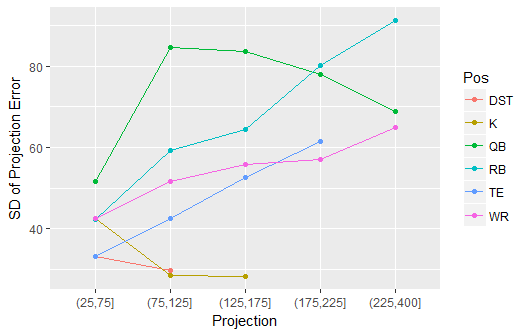
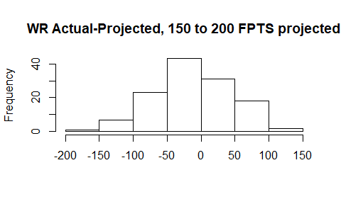

Optimization for Fantasy Football Snake Drafts
---------
-   [Base Case](#base-case)
-   [More Complex Case](#more-complex-case)
    -   [Error Analysis](#error-analysis)
    -   [Simulation](#simulation)
    -   [Optimizing Parameters](#optimizing-parameters)
    -   [Analyzing Bias](#analyzing-bias)
-   [Conclusion](#conclusion)

------------------------------------------------------------------------

Base Case
---------

Optimizing your strategy for a fantasy football draft is an interesting problem. Should you should go RB early? Wait on RB's? Should you do something productive with your free time instead of fantasy football? (probably). Optimizing your draft picks can be viewed as an optimization where you try to maximize the projected points of your selected players. In this post I will go through my optimization methodology. To start, I have a dataframe of players and their projected points and their ADPs (Average draft positions).

``` r
head(adp, 25)
```

    ##                  Player ADP_est ADPSD_est Pos ADP_Rank     HALF      STD      PPR
    ## 649         Todd Gurley    1.85      0.90  RB        1 282.9787 253.3955 312.6844
    ## 440         Leveon Bell    2.25      1.00  RB        2 280.2661 241.5337 318.9930
    ## 258     Ezekiel Elliott    3.40      1.35  RB        3 243.0664 225.0725 261.2155
    ## 188       David Johnson    3.90      1.10  RB        4 231.0491 200.2815 261.8184
    ## 39        Antonio Brown    5.10      1.40  WR        5 249.9520 197.1996 302.7505
    ## 27         Alvin Kamara    6.00      1.25  RB        6 244.1499 210.1303 278.2076
    ## 599      Saquon Barkley    6.80      1.80  RB        7 217.0454 191.3802 242.7106
    ## 193     Deandre Hopkins    8.80      1.90  WR        8 217.0354 172.1881 261.9242
    ## 400         Kareem Hunt    9.30      1.75  RB        9 225.6042 200.8797 250.3842
    ## 437   Leonard Fournette   10.00      1.80  RB       10 211.9753 194.3041 229.7181
    ## 494       Melvin Gordon   10.45      2.05  RB       11 210.7663 186.6919 234.8665
    ## 533       Odell Beckham   11.50      2.05  WR       12 196.6366 154.1821 239.0949
    ## 167         Dalvin Cook   12.90      2.00  RB       13 201.3612 181.3044 221.4412
    ## 386         Julio Jones   14.10      2.15  WR       14 217.1109 172.4447 261.8512
    ## 507      Michael Thomas   15.90      2.30  WR       15 205.7079 159.7206 251.8222
    ## 223     Devonta Freeman   17.55      2.50  RB       16 200.1333 178.9294 221.3382
    ## 186       Davante Adams   18.10      2.40  WR       17 179.4036 141.6187 217.2282
    ## 403        Keenan Allen   18.40      2.50  WR       18 190.3322 148.0730 232.4604
    ## 439        Lesean Mccoy   18.85      2.90  RB       19 194.0505 168.3635 219.7331
    ## 133 Christian Mccaffrey   20.15      3.10  RB       20 210.7556 174.8497 246.5142
    ## 10             Aj Green   20.55      2.25  WR       21 181.8014 143.4386 220.1942
    ## 341     Jerick Mckinnon   20.60      3.50  RB       22 190.1646 163.1598 217.0976
    ## 359       Jordan Howard   22.10      3.05  RB       23 168.6739 155.7119 181.6984
    ## 500       Michael Evans   23.55      2.75  WR       24 179.9113 143.0565 216.8329
    ## 571   Robert Gronkowski   23.70      3.65  TE       25 174.9817 141.7510 208.1159

<br />For league settings, I am using Yahoo's defaults[1]. I can then easily set up an optimization where I say to maximize the sum of the projected points of the 15 players taken. Given the slot I am picking at, which for this example I will say is slot 4, I just constrain it to take 15 players with ADP&gt;=4, 14 players with ADP&gt;=21, etc. The end result is a function which takes different parameters for the optimization and returns the optimal draft picks.

``` r
getPicks(slot="Slot4", numRB=4, numWR = 6,numTE=1,numK=1,numQB=2, numDST=1,numFLEX = 0,shift=0,  out=c(), fix=c(), scoring='HALF')
```

    ##                  Player ADP_est ADP_Rank Pos     HALF Slot
    ## 27         Alvin Kamara    6.00      6.0  RB 244.1499    4
    ## 341     Jerick Mckinnon   20.60     22.0  RB 190.1646   21
    ## 681         Tyreek Hill   29.65     29.0  WR 196.4085   28
    ## 384 Juju Smith Schuster   42.35     45.0  WR 178.8367   45
    ## 585      Russell Wilson   57.10     57.5  QB 300.8192   52
    ## 98           Cam Newton   74.05     76.0  QB 284.7175   69
    ## 201      Delanie Walker   79.15     80.0  TE 133.6574   76
    ## 152         Cooper Kupp  100.70    100.0  WR 147.1439   93
    ## 569      Robby Anderson  104.65    107.0  WR 144.4480  100
    ## 620    Sterling Shepard  119.10    125.0  WR 139.7624  117
    ## 224     Devontae Booker  119.40    126.0  RB 119.9492  124
    ## 567    Rishard Matthews  142.75    146.0  WR 132.9246  141
    ## 314         James White  149.30    155.0  RB 136.0711  148
    ## 548                 Pit  163.35    186.0 DST 122.0000  165
    ## 283     Harrison Butker      NA    500.0   K 145.3158  172

<br />The parameters of getPicks() specify number of players at each position to take. I also added the shift parameter which can shift everyone's ADP by a given fraction i.e. shift=.1 would subtract 10% from everyone's ADP. I can also make adjustments like constraining to only select 1QB in the first 10 rounds.

``` r
getPicks(slot="Slot4", numRB=4, numWR = 6,numTE=1,numK=1,numQB=2, numDST=1,numFLEX = 0,shift=0,  out=c(), fix=c(), scoring='HALF', onePos=rep("QB", 10))
```

    ##                  Player ADP_est ADP_Rank Pos     HALF Slot
    ## 27         Alvin Kamara    6.00      6.0  RB 244.1499    4
    ## 341     Jerick Mckinnon   20.60     22.0  RB 190.1646   21
    ## 681         Tyreek Hill   29.65     29.0  WR 196.4085   28
    ## 384 Juju Smith Schuster   42.35     45.0  WR 178.8367   45
    ## 585      Russell Wilson   57.10     57.5  QB 300.8192   52
    ## 629         Tarik Cohen   75.80     78.0  RB 128.4949   69
    ## 201      Delanie Walker   79.15     80.0  TE 133.6574   76
    ## 152         Cooper Kupp  100.70    100.0  WR 147.1439   93
    ## 569      Robby Anderson  104.65    107.0  WR 144.4480  100
    ## 407     Kelvin Benjamin  112.70    117.0  WR 137.3654  117
    ## 620    Sterling Shepard  119.10    125.0  WR 139.7624  124
    ## 22      Alexander Smith  148.65    152.0  QB 265.3228  141
    ## 314         James White  149.30    155.0  RB 136.0711  148
    ## 548                 Pit  163.35    186.0 DST 122.0000  165
    ## 283     Harrison Butker      NA    500.0   K 145.3158  172

Rotoviz [already has an app](http://rotoviz.com/2017/08/using-the-rotoviz-draft-optimizer-to-dominate-your-ppr-draft/) which does a similar optimization. The results do seem to suggest certain things like how you should often take RB's early. Looking at the optimal first two picks for each draft slot, you can see how RB's are usually suggested for the early picks:

``` r
sapply(paste0("Slot", 1:12), function(x) getPicks(slot=x, numRB=4, numWR = 6,numTE=1,numK=1,numQB=2, numDST=1,numFLEX = 0,shift=0,  out=c(), fix=c(), scoring='HALF')[1:2,],simplify = FALSE,USE.NAMES = TRUE)
```

    ## $Slot1
    ##                Player ADP_est ADP_Rank Pos     HALF Slot
    ## 649       Todd Gurley    1.85        1  RB 282.9787    1
    ## 571 Robert Gronkowski   23.70       25  TE 174.9817   24
    ## 
    ## $Slot2
    ##                Player ADP_est ADP_Rank Pos     HALF Slot
    ## 440       Leveon Bell    2.25        2  RB 280.2661    2
    ## 571 Robert Gronkowski   23.70       25  TE 174.9817   23
    ## 
    ## $Slot3
    ##              Player ADP_est ADP_Rank Pos     HALF Slot
    ## 27     Alvin Kamara     6.0        6  RB 244.1499    3
    ## 341 Jerick Mckinnon    20.6       22  RB 190.1646   22
    ## 
    ## $Slot4
    ##              Player ADP_est ADP_Rank Pos     HALF Slot
    ## 27     Alvin Kamara     6.0        6  RB 244.1499    4
    ## 341 Jerick Mckinnon    20.6       22  RB 190.1646   21
    ## 
    ## $Slot5
    ##                  Player ADP_est ADP_Rank Pos     HALF Slot
    ## 27         Alvin Kamara    6.00        6  RB 244.1499    5
    ## 133 Christian Mccaffrey   20.15       20  RB 210.7556   20
    ## 
    ## $Slot6
    ##                  Player ADP_est ADP_Rank Pos     HALF Slot
    ## 27         Alvin Kamara    6.00        6  RB 244.1499    6
    ## 133 Christian Mccaffrey   20.15       20  RB 210.7556   19
    ## 
    ## $Slot7
    ##                  Player ADP_est ADP_Rank Pos     HALF Slot
    ## 400         Kareem Hunt    9.30        9  RB 225.6042    7
    ## 133 Christian Mccaffrey   20.15       20  RB 210.7556   18
    ## 
    ## $Slot8
    ##                  Player ADP_est ADP_Rank Pos     HALF Slot
    ## 400         Kareem Hunt    9.30        9  RB 225.6042    8
    ## 133 Christian Mccaffrey   20.15       20  RB 210.7556   17
    ## 
    ## $Slot9
    ##                  Player ADP_est ADP_Rank Pos     HALF Slot
    ## 400         Kareem Hunt    9.30        9  RB 225.6042    9
    ## 133 Christian Mccaffrey   20.15       20  RB 210.7556   16
    ## 
    ## $Slot10
    ##                  Player ADP_est ADP_Rank Pos     HALF Slot
    ## 437   Leonard Fournette   10.00       10  RB 211.9753   10
    ## 133 Christian Mccaffrey   20.15       20  RB 210.7556   15
    ## 
    ## $Slot11
    ##                  Player ADP_est ADP_Rank Pos     HALF Slot
    ## 494       Melvin Gordon   10.45       11  RB 210.7663   11
    ## 133 Christian Mccaffrey   20.15       20  RB 210.7556   14
    ## 
    ## $Slot12
    ##                  Player ADP_est ADP_Rank Pos     HALF Slot
    ## 167         Dalvin Cook   12.90       13  RB 201.3612   12
    ## 133 Christian Mccaffrey   20.15       20  RB 210.7556   13

<br />There are some shortcomings with using this basic optimization to inform your strategy. First of all, the thing you want to optimize is not all of your picks' points--**a more appropriate objective would be to draft in a way that will give you the eventual best starting lineup**. This would ideally take into account the uncertainty of the projections, the fact that you can only start a limited number of each position, and the possibility of getting waiver wire adds. I'll show how I account for this below.

------------------------------------------------------------------------

More Complex Case
-----------------

For the more complicated case, my methodology will be to get an optimal lineup, but I will evaluate its performance not by the sum of the projected points, but rather by how strong it's mean-simulated top starting lineup is. I will explain this in depth later. To do this method though, I will first need estimates of the errors of the projections. It is widely assumed that RBs have errors with high variance while something like a TE has low variance, and so this should be accounted for when simulating the actual values from the projections.

### Error Analysis

I summarize below the projection error (projected-actual) for 2012-2017, grouped by projection range and position.

    ##    fantPts_bin Pos    meanError medianError meanRelativeError  sdError   n
    ## 3     (50,100] DST -16.50746269  -11.000000     -0.1844335833 29.04822  67
    ## 12   (100,150] DST -17.42622951  -15.000000     -0.1576234275 30.41297  61
    ## 13   (100,150]   K   1.92049545   -2.837514      0.0124510067 32.26448 166
    ## 6     (50,100]  QB -12.96164604    6.422376     -0.1817914902 68.02034  35
    ## 22   (150,200]  QB   3.71707735   32.152760      0.0188133054 87.13484  24
    ## 26   (200,250]  QB  11.83994287    2.326052      0.0557565726 70.04558  58
    ## 30   (250,400]  QB   9.22522616   -3.942264      0.0285062558 70.68462  93
    ## 7     (50,100]  RB  -2.79001375    6.711252     -0.0498555836 53.26364 194
    ## 16   (100,150]  RB  22.09952819   23.166367      0.1751427011 62.26261 138
    ## 23   (150,200]  RB  19.30728640   12.515446      0.1175076305 71.29497  86
    ## 27   (200,250]  RB  35.07334805   34.657404      0.1543440065 93.87923  42
    ## 8     (50,100]  TE   4.80893126    6.406903      0.0566032083 39.81488 149
    ## 17   (100,150]  TE  11.41815408    4.492884      0.0893742868 46.09589  78
    ## 9     (50,100]  WR   0.05253393   10.493952      0.0005048886 48.37551 279
    ## 18   (100,150]  WR  14.58023486   17.667796      0.1216905776 52.90124 190
    ## 25   (150,200]  WR  12.30101110   13.345315      0.0693436514 55.85909 125
    ## 29   (200,250]  WR  20.18237638   12.716619      0.0962855543 67.41880  44

Plotting the above standard deviations of the errors by position:



I can also look at an example plot of one of these subgroups ex: WRs with projections between 150-200:



Looking at the above data and plots, I see how error variance is a function of position and projection. Looking at the example histogram above, the errors do appear pretty normally distributed. I should mention that in the table I do see that there appears to be bias in my projections for certain positions (positive mean/median value implies projections that are overprojecting), I will revisit this at another time and for now assume unbiased errors. Below is an overview of the assumptions I am making when I simulate the seasons.

**Assumption 1.** For simplicity I am assuming that errors are normally distributed with mean 0 and a standard deviation based on the SD for their position and projection.<br /> **Assumption 2.** I also assume that you will be able to pick up undrafted players. I assume you will be able to get the third highest performing undrafted player at each position. This may be aggressive but it's likely that if you only need DST and TE mid-season, you will be able to get a strong one at both.

### Simulation

Finally, I am ready to simulate a season from my optimal lineup.

First I get the optimal picks at Slot=4/12, same as in base case:

    ##                  Player ADP_est ADP_Rank Pos     HALF Slot
    ## 27         Alvin Kamara    6.00      6.0  RB 244.1499    4
    ## 341     Jerick Mckinnon   20.60     22.0  RB 190.1646   21
    ## 681         Tyreek Hill   29.65     29.0  WR 196.4085   28
    ## 384 Juju Smith Schuster   42.35     45.0  WR 178.8367   45
    ## 585      Russell Wilson   57.10     57.5  QB 300.8192   52
    ## 98           Cam Newton   74.05     76.0  QB 284.7175   69
    ## 201      Delanie Walker   79.15     80.0  TE 133.6574   76
    ## 152         Cooper Kupp  100.70    100.0  WR 147.1439   93
    ## 569      Robby Anderson  104.65    107.0  WR 144.4480  100
    ## 620    Sterling Shepard  119.10    125.0  WR 139.7624  117
    ## 224     Devontae Booker  119.40    126.0  RB 119.9492  124
    ## 567    Rishard Matthews  142.75    146.0  WR 132.9246  141
    ## 314         James White  149.30    155.0  RB 136.0711  148
    ## 548                 Pit  163.35    186.0 DST 122.0000  165
    ## 283     Harrison Butker      NA    500.0   K 145.3158  172

Then I can get the top starting lineup from 1 simulation, Projected Points=HALF. Simulated Points=Sim:

    ##                 Player ADP_est ADP_Rank Pos     HALF Slot  ScoreSD      Sim
    ## 1         Alvin Kamara    6.00      6.0  RB 244.1499    4 91.78148 406.2991
    ## 5       Russell Wilson   57.10     57.5  QB 300.8192   52 70.00000 384.5143
    ## 2      Jerick Mckinnon   20.60     22.0  RB 190.1646   21 77.38360 227.6390
    ## 3          Tyreek Hill   29.65     29.0  WR 196.4085   28 61.96128 185.9254
    ## 9       Robby Anderson  104.65    107.0  WR 144.4480  100 54.16721 182.7845
    ## 4  Juju Smith Schuster   42.35     45.0  WR 178.8367   45 59.32550 167.9582
    ## 15     Harrison Butker      NA    500.0   K 145.3158  172 30.00000 159.8173
    ## 14                 Pit  163.35    186.0 DST 122.0000  165 30.00000 129.8193
    ## 7       Delanie Walker   79.15     80.0  TE 133.6574   76 48.04862 118.2814

Finally, I can repeat this a large number of times to get the mean-simulated optimal lineup from a set of picks.

### Optimizing Parameters

The last step of the system is to test different parameters. I can specify things like number of players to take at each position or whether I should lock in a certain player. I repeat the above simulation many times and I want to find the parameters that result in the best mean-simulated optimal lineup. Below I plot the simulation results for different parameter combinations. <br /> <br />


<br /> In the plot you can see the effect of different actions. For example, it suggests you should definitely take 2 QBs, as the 1 QB test (case 6) performs very poorly. Taking Antonio Brown instead of Kamara in round 1 slightly decreases the median-simulated starting lineup, despite Antonio Brown's raw projection actually being higher than Kamara's. The planned draft from the optimal parameter combo (case 3) is shown below.

``` r
getPicks(slot="Slot4", numRB=4, numWR = 6,numTE=1,numK=1,numQB=2, numDST=1,numFLEX = 0,shift=0,  out=c(), fix=c(), scoring='HALF')
```

    ##                  Player ADP_est ADP_Rank Pos     HALF Slot
    ## 27         Alvin Kamara    6.00      6.0  RB 244.1499    4
    ## 341     Jerick Mckinnon   20.60     22.0  RB 190.1646   21
    ## 681         Tyreek Hill   29.65     29.0  WR 196.4085   28
    ## 384 Juju Smith Schuster   42.35     45.0  WR 178.8367   45
    ## 585      Russell Wilson   57.10     57.5  QB 300.8192   52
    ## 98           Cam Newton   74.05     76.0  QB 284.7175   69
    ## 201      Delanie Walker   79.15     80.0  TE 133.6574   76
    ## 152         Cooper Kupp  100.70    100.0  WR 147.1439   93
    ## 569      Robby Anderson  104.65    107.0  WR 144.4480  100
    ## 620    Sterling Shepard  119.10    125.0  WR 139.7624  117
    ## 224     Devontae Booker  119.40    126.0  RB 119.9492  124
    ## 567    Rishard Matthews  142.75    146.0  WR 132.9246  141
    ## 314         James White  149.30    155.0  RB 136.0711  148
    ## 548                 Pit  163.35    186.0 DST 122.0000  165
    ## 283     Harrison Butker      NA    500.0   K 145.3158  172

### Analyzing Bias

Before I mentioned that the projections I am using have been biased for certain positions. For the last part of my analysis I'd like to see how the bias might affect my results. Looking at the errors, I'm going to create a shifted projection "HALF2" that accounts for bias and then I will repeat the previous analysis.

``` r
#shift RB-20, TE-10, QB-10, WR-15, DST+10:
adp$HALF2<-ifelse(adp$Pos=="RB"& adp$HALF>=100, adp$HALF-20,
                  ifelse(adp$Pos%in% c("TE", "QB")& adp$HALF>100, adp$HALF-10, 
                         ifelse(grepl("WR", adp$Pos)& adp$HALF>100, adp$HALF-15, 
                                ifelse(adp$Pos%in% "DST", adp$HALF+10, adp$HALF   )))) 

#getPicks() with "HALF2" scoring
getPicks(slot="Slot4", numRB=4, numWR = 6,numTE=1,numK=1,numQB=2, numDST=1,numFLEX = 0,shift=0,  out=c(), fix=c(), scoring='HALF2')
```

    ##                  Player ADP_est ADP_Rank Pos     HALF2 Slot
    ## 27         Alvin Kamara    6.00      6.0  RB 224.14990    4
    ## 341     Jerick Mckinnon   20.60     22.0  RB 170.16459   21
    ## 681         Tyreek Hill   29.65     29.0  WR 181.40852   28
    ## 384 Juju Smith Schuster   42.35     45.0  WR 163.83668   45
    ## 585      Russell Wilson   57.10     57.5  QB 290.81921   52
    ## 98           Cam Newton   74.05     76.0  QB 274.71751   69
    ## 201      Delanie Walker   79.15     80.0  TE 123.65744   76
    ## 152         Cooper Kupp  100.70    100.0  WR 132.14390   93
    ## 569      Robby Anderson  104.65    107.0  WR 129.44804  100
    ## 407     Kelvin Benjamin  112.70    117.0  WR 122.36538  117
    ## 620    Sterling Shepard  119.10    125.0  WR 124.76239  124
    ## 530        Nyheim Hines  136.80    142.0  RB  95.92697  141
    ## 314         James White  149.30    155.0  RB 116.07105  148
    ## 548                 Pit  163.35    186.0 DST 132.00000  165
    ## 283     Harrison Butker      NA    500.0   K 145.31579  172

The optimal solution for the base case does not change anything. Thinking about it, it makes sense. I need to take a fixed number at each position and so am basically judging each position independently and shifting it doesn't have an effect. Next I repeat the parameter optimization to see the effect of my projections' bias on that.


The results are similar and back up many of the initial findings.

------------------------------------------------------------------------

Conclusion
----------

In conclusion, I created a system that optimizes to get the best eventual starting lineup for fantasy football. In testing different strategies, it seems you should definitely draft 2 QBs, you should probably draft RB first, and you should most likely not do zero-RB. I also looked at bias in my projections and found that having projections that are biased for a certain position does not have much effect on the results. The main flaw still remaining in all of this is the uncertainty in opponent picks. If an optimal strategy depends on getting a high value QB in round 10 for example, it should factor in what happens if someone else takes the QB. I will talk about that in a future post. <br /><br />

[1] 12-team league with 15 picks per team. Positions=1 QB, 2 WR, 2 RB, 1 TE, 1 FLEX, 1 DST, 1 K. Scoring = .5 PPR
