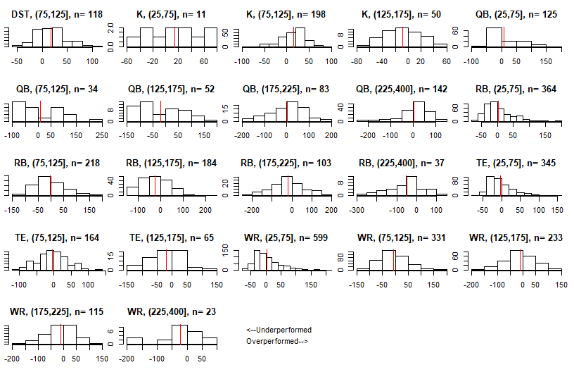

Optimization for Fantasy Football Snake Drafts
---------
-   [Base Case](#base-case)
-   [More Complex Case](#more-complex-case)
    -   [Error Analysis](#error-analysis)
    -   [Simulation](#simulation)
    -   [Optimizing Parameters](#optimizing-parameters)
    -   [Analyzing Bias](#analyzing-bias)
-   [Conclusion](#conclusion)

------------------------------------------------------------------------

Base Case
---------

Optimizing your strategy for a fantasy football draft is an interesting problem. Should you should go RB early? Wait on RB's? Should you do something productive with your free time instead of fantasy football? (probably). Optimizing your draft picks can be viewed as an optimization where you try to maximize the projected points of your selected players. In this post I will go through my optimization methodology. To start, I have a dataframe of players and their projected points and their ADPs (Average draft positions).

``` r
head(adp[, c("Player", "Pos", "ADP_est", "ADPSD_est", "ADP_Rank", "HALF", "STD", "PPR")], 25)
```

    ##                  Player Pos ADP_est ADPSD_est ADP_Rank     HALF      STD      PPR
    ## 120         Todd Gurley  RB    1.85      0.90        1 286.9787 278.7288 295.3511
    ## 119         Leveon Bell  RB    2.25      1.00        2 285.5994 276.2004 294.9930
    ## 118     Ezekiel Elliott  RB    3.40      1.35        3 245.7330 240.7392 250.8822
    ## 117       David Johnson  RB    3.90      1.10        4 237.7158 232.9482 242.4851
    ## 123       Antonio Brown  WR    5.10      1.40        5 244.1744 220.2120 268.1369
    ## 122        Alvin Kamara  RB    6.00      1.25        6 245.4832 235.7970 255.2076
    ## 82       Saquon Barkley  RB    6.80      1.80        7 221.9244 216.4002 227.4485
    ## 87      Deandre Hopkins  WR    8.80      1.90        8 217.1364 196.1761 238.0967
    ## 121         Kareem Hunt  RB    9.30      1.75        9 229.6042 222.5463 236.7176
    ## 78    Leonard Fournette  RB   10.00      1.80       10 213.3087 207.6375 219.0514
    ## 79        Melvin Gordon  RB   10.45      2.05       11 212.0997 205.3586 218.8665
    ## 89        Odell Beckham  WR   11.50      2.05       12 196.8351 178.9319 214.7382
    ## 76          Dalvin Cook  RB   12.90      2.00       13 204.0279 199.3044 208.7746
    ## 93          Julio Jones  WR   14.10      2.15       14 224.4879 202.2329 246.7428
    ## 85       Michael Thomas  WR   15.90      2.30       15 208.1782 188.1379 228.2185
    ## 81      Devonta Freeman  RB   17.55      2.50       16 202.7999 196.5961 209.0049
    ## 94        Davante Adams  WR   18.10      2.40       17 176.9410 161.1901 192.6918
    ## 95         Keenan Allen  WR   18.40      2.50       18 193.9841 176.8953 211.0729
    ## 80         Lesean Mccoy  RB   18.85      2.90       19 195.3838 189.0302 201.7331
    ## 83  Christian Mccaffrey  RB   20.15      3.10       20 213.4223 203.1830 223.5142
    ## 96             Aj Green  WR   20.55      2.25       21 185.0449 168.3994 201.6903
    ## 77      Jerick Mckinnon  RB   20.60      3.50       22 194.1646 187.8265 200.4310
    ## 26        Jordan Howard  RB   22.10      3.05       23 170.0072 166.0453 174.0318
    ## 86        Michael Evans  WR   23.55      2.75       24 182.9814 164.8576 201.1052
    ## 84    Robert Gronkowski  TE   23.70      3.65       25 176.8560 160.0528 193.6592

<br />For league settings, I am using Yahoo's defaults[1]. I can then easily set up an optimization where I say to maximize the sum of the projected points of the 15 players taken. Given the slot I am picking at, which for this example I will say is slot 4, I just constrain it to take 15 players with ADP&gt;=4, 14 players with ADP&gt;=21, etc. The end result is a function which takes different parameters for the optimization and returns the optimal draft picks.

``` r
getPicks(slot="Slot4", numRB=4, numWR = 6,numTE=1,numK=1,numQB=2, numDST=1,numFLEX = 0,shift=0,  out=c(), fix=c(), scoring='HALF')
```

    ##     Pos              Player ADP_est ADP_Rank     HALF Slot
    ## 122  RB        Alvin Kamara    6.00      6.0 245.4832    4
    ## 77   RB     Jerick Mckinnon   20.60     22.0 194.1646   21
    ## 88   WR         Tyreek Hill   29.65     29.0 184.3552   28
    ## 90   WR Juju Smith Schuster   42.35     45.0 179.3604   45
    ## 106  QB      Russell Wilson   57.10     57.5 291.4859   52
    ## 109  QB          Cam Newton   74.05     76.0 274.0508   69
    ## 32   TE      Delanie Walker   79.15     80.0 132.7886   76
    ## 61   WR         Cooper Kupp  100.70    100.0 149.4343   93
    ## 42   WR      Robby Anderson  104.65    107.0 145.7251  100
    ## 62   WR    Sterling Shepard  119.10    125.0 139.7021  117
    ## 387  RB     Devontae Booker  119.40    126.0 122.6159  124
    ## 40   WR    Rishard Matthews  142.75    146.0 133.4577  141
    ## 30   RB         James White  149.30    155.0 137.4044  148
    ## 315 DST                 Pit  163.35    186.0 122.0000  165
    ## 5     K     Harrison Butker      NA    500.0 145.3158  172

<br />The parameters of getPicks() specify number of players at each position to take. I also added the shift parameter which can shift everyone's ADP by a given fraction i.e. shift=.1 would subtract 10% from everyone's ADP. I can also make adjustments like constraining to only select 1QB in the first 10 rounds.

``` r
getPicks(slot="Slot4", numRB=4, numWR = 6,numTE=1,numK=1,numQB=2, numDST=1,numFLEX = 0,shift=0,  out=c(), fix=c(), scoring='HALF', onePos=rep("QB", 10))
```

    ##     Pos              Player ADP_est ADP_Rank     HALF Slot
    ## 122  RB        Alvin Kamara    6.00      6.0 245.4832    4
    ## 77   RB     Jerick Mckinnon   20.60     22.0 194.1646   21
    ## 88   WR         Tyreek Hill   29.65     29.0 184.3552   28
    ## 90   WR Juju Smith Schuster   42.35     45.0 179.3604   45
    ## 106  QB      Russell Wilson   57.10     57.5 291.4859   52
    ## 15   RB         Tarik Cohen   75.80     78.0 132.4949   69
    ## 32   TE      Delanie Walker   79.15     80.0 132.7886   76
    ## 61   WR         Cooper Kupp  100.70    100.0 149.4343   93
    ## 42   WR      Robby Anderson  104.65    107.0 145.7251  100
    ## 39   WR     Kelvin Benjamin  112.70    117.0 137.0975  117
    ## 62   WR    Sterling Shepard  119.10    125.0 139.7021  124
    ## 107  QB     Alexander Smith  148.65    152.0 259.3228  141
    ## 30   RB         James White  149.30    155.0 137.4044  148
    ## 315 DST                 Pit  163.35    186.0 122.0000  165
    ## 5     K     Harrison Butker      NA    500.0 145.3158  172

Rotoviz [already has an app](http://rotoviz.com/2017/08/using-the-rotoviz-draft-optimizer-to-dominate-your-ppr-draft/) which does a similar optimization. The results do seem to suggest certain things like how you should often take RB's early. Looking at the optimal first two picks for each draft slot, you can see how RB's are usually suggested for the early picks:

``` r
sapply(paste0("Slot", 1:12), function(x) getPicks(slot=x, numRB=4, numWR = 6,numTE=1,numK=1,numQB=2, numDST=1,numFLEX = 0,shift=0,  out=c(), fix=c(), scoring='HALF')[1:2,],simplify = FALSE,USE.NAMES = TRUE)
```

    ## $Slot1
    ##     Pos            Player ADP_est ADP_Rank     HALF Slot
    ## 120  RB       Todd Gurley    1.85        1 286.9787    1
    ## 84   TE Robert Gronkowski   23.70       25 176.8560   24
    ## 
    ## $Slot2
    ##     Pos            Player ADP_est ADP_Rank     HALF Slot
    ## 119  RB       Leveon Bell    2.25        2 285.5994    2
    ## 84   TE Robert Gronkowski   23.70       25 176.8560   23
    ## 
    ## $Slot3
    ##     Pos          Player ADP_est ADP_Rank     HALF Slot
    ## 118  RB Ezekiel Elliott     3.4        3 245.7330    3
    ## 77   RB Jerick Mckinnon    20.6       22 194.1646   22
    ## 
    ## $Slot4
    ##     Pos          Player ADP_est ADP_Rank     HALF Slot
    ## 122  RB    Alvin Kamara     6.0        6 245.4832    4
    ## 77   RB Jerick Mckinnon    20.6       22 194.1646   21
    ## 
    ## $Slot5
    ##     Pos              Player ADP_est ADP_Rank     HALF Slot
    ## 122  RB        Alvin Kamara    6.00        6 245.4832    5
    ## 83   RB Christian Mccaffrey   20.15       20 213.4223   20
    ## 
    ## $Slot6
    ##     Pos              Player ADP_est ADP_Rank     HALF Slot
    ## 122  RB        Alvin Kamara    6.00        6 245.4832    6
    ## 83   RB Christian Mccaffrey   20.15       20 213.4223   19
    ## 
    ## $Slot7
    ##     Pos              Player ADP_est ADP_Rank     HALF Slot
    ## 121  RB         Kareem Hunt    9.30        9 229.6042    7
    ## 83   RB Christian Mccaffrey   20.15       20 213.4223   18
    ## 
    ## $Slot8
    ##     Pos              Player ADP_est ADP_Rank     HALF Slot
    ## 121  RB         Kareem Hunt    9.30        9 229.6042    8
    ## 83   RB Christian Mccaffrey   20.15       20 213.4223   17
    ## 
    ## $Slot9
    ##     Pos              Player ADP_est ADP_Rank     HALF Slot
    ## 121  RB         Kareem Hunt    9.30        9 229.6042    9
    ## 83   RB Christian Mccaffrey   20.15       20 213.4223   16
    ## 
    ## $Slot10
    ##    Pos              Player ADP_est ADP_Rank     HALF Slot
    ## 78  RB   Leonard Fournette   10.00       10 213.3087   10
    ## 83  RB Christian Mccaffrey   20.15       20 213.4223   15
    ## 
    ## $Slot11
    ##    Pos              Player ADP_est ADP_Rank     HALF Slot
    ## 79  RB       Melvin Gordon   10.45       11 212.0997   11
    ## 83  RB Christian Mccaffrey   20.15       20 213.4223   14
    ## 
    ## $Slot12
    ##    Pos              Player ADP_est ADP_Rank     HALF Slot
    ## 93  WR         Julio Jones   14.10       14 224.4879   12
    ## 83  RB Christian Mccaffrey   20.15       20 213.4223   13

<br />There are some shortcomings with using this basic optimization to inform your strategy. First of all, the thing you want to optimize is not all of your picks' points--**a more appropriate objective would be to draft in a way that will give you the eventual best starting lineup**. This would ideally take into account the uncertainty of the projections, the fact that you can only start a limited number of each position, and the possibility of getting waiver wire adds. I'll show how I account for this below.

------------------------------------------------------------------------

More Complex Case
-----------------

For the more complicated case, my methodology will be to get an optimal lineup, but I will evaluate its performance not by the sum of the projected points, but rather by how strong it's mean-simulated top starting lineup is. I will explain this in depth later. To do this method though, I will first need estimates of the errors of the projections. It is widely assumed that RBs have errors with high variance while something like a TE has low variance, and so this should be accounted for when simulating the actual values from the projections.

### Error Analysis

I summarize below the projection error (actual-projected) for 2009-2017, grouped by projection range and position. A negative mean-value means players have underperformed for that subgroup. A high SD value means players; performance has been more volatile in that subgroup:

    ##    fantPts_bin Pos  meanError medianError  sdError   n
    ## 4      (25,75] DST   7.666667   -3.500000 33.10992   6
    ## 13    (75,125] DST  17.542373   12.000000 29.61336 118
    ## 5      (25,75]   K  13.788522   15.425605 42.57718  11
    ## 14    (75,125]   K  14.556467   16.501889 28.48010 198
    ## 22   (125,175]   K  -8.139669   -8.531961 28.08898  50
    ## 7      (25,75]  QB   7.924877   -9.800000 51.62458 125
    ## 16    (75,125]  QB   8.771959   -9.153795 84.60471  34
    ## 24   (125,175]  QB -20.094962  -49.006279 83.69827  52
    ## 28   (175,225]  QB   1.696868   16.909655 77.97935  83
    ## 32   (225,400]  QB   4.746088   17.668665 68.98852 142
    ## 8      (25,75]  RB   2.842122   -8.079204 42.24322 360
    ## 17    (75,125]  RB  -3.965397  -13.923055 59.31428 218
    ## 25   (125,175]  RB -24.732960  -23.050371 64.53592 184
    ## 29   (175,225]  RB -20.815804  -22.195431 80.09488 103
    ## 33   (225,400]  RB -52.632221  -40.454483 91.39643  37
    ## 9      (25,75]  TE  -2.415085  -10.941867 33.11226 343
    ## 18    (75,125]  TE  -4.810404   -3.372042 42.56975 164
    ## 26   (125,175]  TE -18.583065   -8.739259 52.57490  65
    ## 30   (175,225]  TE -18.295723  -22.789903 61.48846   8
    ## 10     (25,75]  WR   3.406541   -7.491818 42.56455 593
    ## 19    (75,125]  WR  -6.952610  -11.369156 51.59724 330
    ## 27   (125,175]  WR -11.229153  -10.060463 55.86669 233
    ## 31   (175,225]  WR -12.854190   -8.263119 57.03709 115
    ## 34   (225,400]  WR -21.528408  -10.719617 64.93034  23

</br> Plotting the above standard deviations of the errors by position:


</br> I can also look at the plots of the actual data by subgroup:



Looking at the above data and plots, I see how different positions have different error distributions. I initially was going to assume all errors are normally distributed, but looking at all plots I see that many of the subgroups are skewed right (ex: RBs 75-125) and some are normally distributed (WRs 125-175). In addition, there appears to be some bias as top RBs have seem to underperformed their projections and DSTs have overperformed my projections. For the bias, I can ignore it and chalk it up to sample size or I can un-bias my projections. This is definitely an important question because it would determine whether I take off points from the projections of the top RBs. I will first assume the projections are not biased and so shift all errors to be centered at 0. I outline the assumptions below.

**Assumption 1.** I will assume the error of a player is randomly sampled from their corresponding error-bin, and I will add a constant to each error bin so that the errors of each bin have mean 0.<br /> **Assumption 2.** I also assume that you will be able to pick up undrafted players. I assume you will be able to get the third highest performing undrafted player at each position. This may be aggressive but it's likely that if you only need DST and TE mid-season, you will be able to get a strong one at both.

### Simulation

Finally, I am ready to simulate a season from my optimal lineup.

First I get the optimal picks at Slot=4/12, same as in base case:

    ##     Pos              Player ADP_est ADP_Rank     HALF Slot
    ## 122  RB        Alvin Kamara    6.00      6.0 245.4832    4
    ## 77   RB     Jerick Mckinnon   20.60     22.0 194.1646   21
    ## 88   WR         Tyreek Hill   29.65     29.0 184.3552   28
    ## 90   WR Juju Smith Schuster   42.35     45.0 179.3604   45
    ## 106  QB      Russell Wilson   57.10     57.5 291.4859   52
    ## 109  QB          Cam Newton   74.05     76.0 274.0508   69
    ## 32   TE      Delanie Walker   79.15     80.0 132.7886   76
    ## 61   WR         Cooper Kupp  100.70    100.0 149.4343   93
    ## 42   WR      Robby Anderson  104.65    107.0 145.7251  100
    ## 62   WR    Sterling Shepard  119.10    125.0 139.7021  117
    ## 387  RB     Devontae Booker  119.40    126.0 122.6159  124
    ## 40   WR    Rishard Matthews  142.75    146.0 133.4577  141
    ## 30   RB         James White  149.30    155.0 137.4044  148
    ## 315 DST                 Pit  163.35    186.0 122.0000  165
    ## 5     K     Harrison Butker      NA    500.0 145.3158  172

Then I can get the top starting lineup from 1 simulation, determining simulated points by sampling from players' error bin. Projected Points=HALF. Simulated Points=Sim:

    ##    Pos              Player ADP_est ADP_Rank      HALF Slot fantPts_bin      error      Sim
    ## 5   QB      Russell Wilson   57.10     57.5 291.48588   52   (225,400]  41.478576 332.9645
    ## 1   RB        Alvin Kamara    6.00      6.0 245.48323    4   (225,400]  37.900172 283.3834
    ## 2   RB     Jerick Mckinnon   20.60     22.0 194.16459   21   (175,225]   3.721077 197.8857
    ## 4   WR Juju Smith Schuster   42.35     45.0 179.36045   45   (175,225]   4.591072 183.9515
    ## 14 DST                 Pit  163.35    186.0 122.00000  165    (75,125]  57.457627 179.4576
    ## 7   TE      Delanie Walker   79.15     80.0 132.78858   76   (125,175]  46.257469 179.0460
    ## 18  WR     Jermaine Kearse      NA    500.0  90.74932   NA    (75,125]  76.459712 167.2090
    ## 10  WR    Sterling Shepard  119.10    125.0 139.70207  117   (125,175]  19.095437 158.7975
    ## 15   K     Harrison Butker      NA    500.0 145.31579  172   (125,175] -12.334207 132.9816

Undrafted players can end up in the top lineup for a given simulation if their HALF+error is better than the players I drafted. Finally, I repeat the simulation a large number of times to get the mean-simulated optimal lineup from a set of picks. The sum of the top lineup will stabilize to a given value as I repeat the top-lineup simulation a large number of times.

### Optimizing Parameters

The last step of the system is to test different parameters. I can specify things like number of players to take at each position or whether I should lock in a certain player. I repeat the above simulation many times and I want to find the parameters that result in the best mean-simulated optimal lineup. Below I plot the simulation results for different parameter combinations. <br /> <br />


<br /> In the plot you can see the effect of different actions. For example, it suggests you should definitely take 2 QBs, as the 1 QB test (case 6) performs very poorly. Taking Antonio Brown instead of Kamara in round 1 slightly decreases the median-simulated starting lineup, despite Antonio Brown's raw projection actually being higher than Kamara's. The planned draft from the optimal parameter combo (case 3) is shown below.

``` r
getPicks(slot="Slot4", numRB=4, numWR = 6,numTE=1,numK=1,numQB=2, numDST=1,numFLEX = 0,shift=0,  out=c(), fix=c(), scoring='HALF')
```

    ##     Pos              Player ADP_est ADP_Rank     HALF Slot
    ## 122  RB        Alvin Kamara    6.00      6.0 245.4832    4
    ## 77   RB     Jerick Mckinnon   20.60     22.0 194.1646   21
    ## 88   WR         Tyreek Hill   29.65     29.0 184.3552   28
    ## 90   WR Juju Smith Schuster   42.35     45.0 179.3604   45
    ## 106  QB      Russell Wilson   57.10     57.5 291.4859   52
    ## 109  QB          Cam Newton   74.05     76.0 274.0508   69
    ## 32   TE      Delanie Walker   79.15     80.0 132.7886   76
    ## 61   WR         Cooper Kupp  100.70    100.0 149.4343   93
    ## 42   WR      Robby Anderson  104.65    107.0 145.7251  100
    ## 62   WR    Sterling Shepard  119.10    125.0 139.7021  117
    ## 387  RB     Devontae Booker  119.40    126.0 122.6159  124
    ## 40   WR    Rishard Matthews  142.75    146.0 133.4577  141
    ## 30   RB         James White  149.30    155.0 137.4044  148
    ## 315 DST                 Pit  163.35    186.0 122.0000  165
    ## 5     K     Harrison Butker      NA    500.0 145.3158  172

### Analyzing Bias

Before I mentioned that the projections I am using have been biased for certain positions. For the last part of my analysis I'd like to see how the bias might affect my results. Looking at the errors, I'm going to create a shifted projection "HALF2" that accounts for bias:

``` r
head(adp[, !grepl("STD|PPR", colnames(adp))], 10)
```

    ##     fantPts_bin Pos            Player ADP_est ADPSD_est ADP_Rank     HALF meanError    HALF2
    ## 120   (225,400]  RB       Todd Gurley    1.85      0.90        1 286.9787 -52.63222 234.3465
    ## 119   (225,400]  RB       Leveon Bell    2.25      1.00        2 285.5994 -52.63222 232.9672
    ## 118   (225,400]  RB   Ezekiel Elliott    3.40      1.35        3 245.7330 -52.63222 193.1008
    ## 117   (225,400]  RB     David Johnson    3.90      1.10        4 237.7158 -52.63222 185.0835
    ## 123   (225,400]  WR     Antonio Brown    5.10      1.40        5 244.1744 -21.52841 222.6460
    ## 122   (225,400]  RB      Alvin Kamara    6.00      1.25        6 245.4832 -52.63222 192.8510
    ## 82    (175,225]  RB    Saquon Barkley    6.80      1.80        7 221.9244 -20.81580 201.1086
    ## 87    (175,225]  WR   Deandre Hopkins    8.80      1.90        8 217.1364 -12.85419 204.2822
    ## 121   (225,400]  RB       Kareem Hunt    9.30      1.75        9 229.6042 -52.63222 176.9720
    ## 78    (175,225]  RB Leonard Fournette   10.00      1.80       10 213.3087 -20.81580 192.4929

From the error analysis, top-rated RB's have underperformed greatly, based on a sample size of around 40. With the bias-adjusted projections, I am now projecting Antonio Brown to do much better than some of the top RBs. I'll now redo the initial optimization, using these new projections:

``` r
#getPicks() with "HALF2" scoring
getPicks(slot="Slot4", numRB=4, numWR = 6,numTE=1,numK=1,numQB=2, numDST=1,numFLEX = 0,shift=0,  out=c(), fix=c(), scoring='HALF2')
```

    ##     Pos              Player ADP_est ADP_Rank     HALF    HALF2 Slot
    ## 123  WR       Antonio Brown    5.10      5.0 244.1744 222.6460    4
    ## 77   RB     Jerick Mckinnon   20.60     22.0 194.1646 173.3488   21
    ## 88   WR         Tyreek Hill   29.65     29.0 184.3552 171.5010   28
    ## 90   WR Juju Smith Schuster   42.35     45.0 179.3604 166.5063   45
    ## 106  QB      Russell Wilson   57.10     57.5 291.4859 296.2320   52
    ## 109  QB          Cam Newton   74.05     76.0 274.0508 278.7969   69
    ## 61   WR         Cooper Kupp  100.70    100.0 149.4343 138.2051   76
    ## 42   WR      Robby Anderson  104.65    107.0 145.7251 134.4959   93
    ## 384  RB        Duke Johnson  106.70    109.0 121.1553 117.1899  100
    ## 387  RB     Devontae Booker  119.40    126.0 122.6159 118.6505  117
    ## 396  TE          Jack Doyle  127.25    131.5 117.6762 112.8658  124
    ## 40   WR    Rishard Matthews  142.75    146.0 133.4577 122.2286  141
    ## 30   RB         James White  149.30    155.0 137.4044 112.6714  148
    ## 315 DST                 Pit  163.35    186.0 122.0000 139.5424  165
    ## 356   K      Matthew Prater  169.30    196.0 124.8721 139.4285  172

The optimal solution for the base case changes in favor of picking Antonio Brown in Round 1. Next I repeat the parameter optimization to see the effect of my projections' bias on that:


The results now are less clear on whether to pick an WR in Round 1, although some conclusions remain the same such as to take a backup QB, and don't go zero-RB. Looking at the top 2 picks by round for the bias-adjusted projections, you can see how the suggested picks changed from before, and the first two rounds suggest more of a mix of picks:

``` r
sapply(paste0("Slot", 1:12), function(x) getPicks(slot=x, numRB=6, numWR = 4,numTE=1,numK=1,numQB=2, numDST=1,numFLEX = 0,shift=0,  out=c(), fix=c(), scoring='HALF2')[1:2,],simplify = FALSE,USE.NAMES = TRUE)
```

    ## $Slot1
    ##     Pos            Player ADP_est ADP_Rank     HALF    HALF2 Slot
    ## 120  RB       Todd Gurley    1.85        1 286.9787 234.3465    1
    ## 84   TE Robert Gronkowski   23.70       25 176.8560 158.5603   24
    ## 
    ## $Slot2
    ##     Pos            Player ADP_est ADP_Rank     HALF    HALF2 Slot
    ## 119  RB       Leveon Bell    2.25        2 285.5994 232.9672    2
    ## 84   TE Robert Gronkowski   23.70       25 176.8560 158.5603   23
    ## 
    ## $Slot3
    ##     Pos          Player ADP_est ADP_Rank     HALF    HALF2 Slot
    ## 123  WR   Antonio Brown     5.1        5 244.1744 222.6460    3
    ## 77   RB Jerick Mckinnon    20.6       22 194.1646 173.3488   22
    ## 
    ## $Slot4
    ##     Pos          Player ADP_est ADP_Rank     HALF    HALF2 Slot
    ## 123  WR   Antonio Brown     5.1        5 244.1744 222.6460    4
    ## 77   RB Jerick Mckinnon    20.6       22 194.1646 173.3488   21
    ## 
    ## $Slot5
    ##    Pos              Player ADP_est ADP_Rank     HALF    HALF2 Slot
    ## 82  RB      Saquon Barkley    6.80        7 221.9244 201.1086    5
    ## 83  RB Christian Mccaffrey   20.15       20 213.4223 192.6065   20
    ## 
    ## $Slot6
    ##    Pos              Player ADP_est ADP_Rank     HALF    HALF2 Slot
    ## 82  RB      Saquon Barkley    6.80        7 221.9244 201.1086    6
    ## 83  RB Christian Mccaffrey   20.15       20 213.4223 192.6065   19
    ## 
    ## $Slot7
    ##    Pos              Player ADP_est ADP_Rank     HALF    HALF2 Slot
    ## 82  RB      Saquon Barkley    6.80        7 221.9244 201.1086    7
    ## 83  RB Christian Mccaffrey   20.15       20 213.4223 192.6065   18
    ## 
    ## $Slot8
    ##    Pos              Player ADP_est ADP_Rank     HALF    HALF2 Slot
    ## 78  RB   Leonard Fournette   10.00       10 213.3087 192.4929    8
    ## 83  RB Christian Mccaffrey   20.15       20 213.4223 192.6065   17
    ## 
    ## $Slot9
    ##    Pos              Player ADP_est ADP_Rank     HALF    HALF2 Slot
    ## 78  RB   Leonard Fournette   10.00       10 213.3087 192.4929    9
    ## 83  RB Christian Mccaffrey   20.15       20 213.4223 192.6065   16
    ## 
    ## $Slot10
    ##    Pos              Player ADP_est ADP_Rank     HALF    HALF2 Slot
    ## 78  RB   Leonard Fournette   10.00       10 213.3087 192.4929   10
    ## 83  RB Christian Mccaffrey   20.15       20 213.4223 192.6065   15
    ## 
    ## $Slot11
    ##    Pos              Player ADP_est ADP_Rank     HALF    HALF2 Slot
    ## 79  RB       Melvin Gordon   10.45       11 212.0997 191.2839   11
    ## 83  RB Christian Mccaffrey   20.15       20 213.4223 192.6065   14
    ## 
    ## $Slot12
    ##    Pos              Player ADP_est ADP_Rank     HALF    HALF2 Slot
    ## 93  WR         Julio Jones   14.10       14 224.4879 211.6337   12
    ## 83  RB Christian Mccaffrey   20.15       20 213.4223 192.6065   13

------------------------------------------------------------------------

Conclusion
----------

In conclusion, I created a system that optimizes to get the best eventual starting lineup for fantasy football. In testing different strategies, it seems you should definitely draft 2 QBs, you should not do zero-RB, and it is unclear if you should draft RB first. The main flaw still remaining in all of this is the uncertainty in opponent picks. If an optimal strategy depends on getting a high value QB in round 10 for example, it should factor in what happens if someone else takes the QB. I will talk about that in a future post. <br /><br />

[1] Yahoo default is 12-team league with 15 picks per team. Positions=1 QB, 2 WR, 2 RB, 1 TE, 1 FLEX, 1 DST, 1 K. Scoring = .5 PPR
