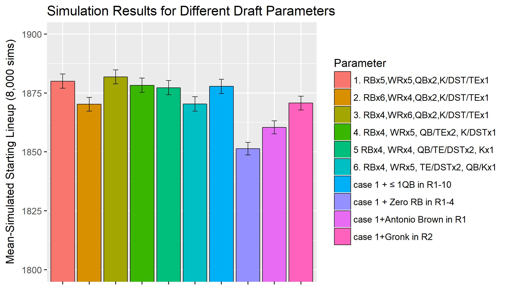
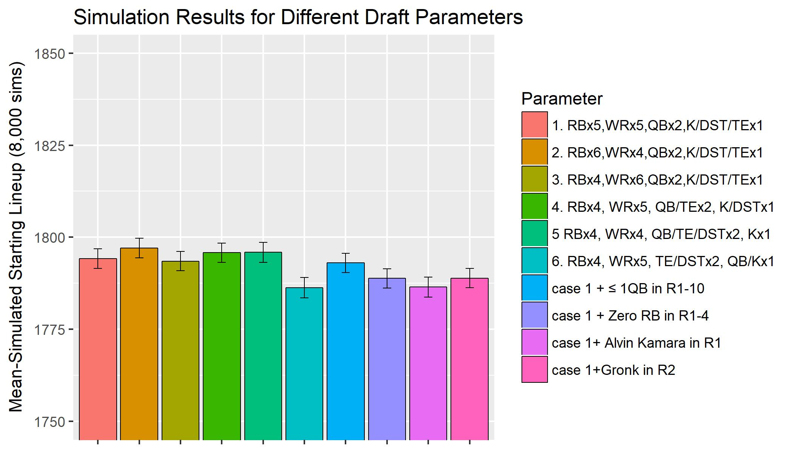

---

## Base Case

```{r set-options, echo=FALSE, cache=FALSE}
options(width = 10000)
```

Optimizing your strategy for a fantasy football draft is an interesting problem. Should you should go RB early? Wait on RB's? Should you do something productive with your free time instead of fantasy football? (probably). Optimizing your draft picks can be viewed as an optimization where you try to maximize the projected points of your selected players. In this post I will go through my optimization methodology. To start, I have a dataframe of players and their projected points and their ADPs (Average draft positions).

```{r include=F, eval=T , echo=F}
###load and prepare data
source("all data, base case.R")

```

```{r include=T, eval=T , echo=T}
head(adp[, c("Player", "Pos", "ADP_est", "ADPSD_est", "ADP_Rank", "HALF", "STD", "PPR")], 25)
```


<br />For league settings, I am using Yahoo's defaults [^1].  I can then easily set up an optimization where I say to maximize the sum of the projected points of the 15 players taken. Given the slot I am picking at, which for this example I will say is slot 4, I just constrain it to take 15 players with ADP>=4, 14 players with ADP>=21, etc. The end result is a function which takes different parameters for the optimization and returns the optimal draft picks.

```{r include=T, eval=T , echo=T}
getPicks(slot="Slot4", numRB=4, numWR = 6,numTE=1,numK=1,numQB=2, numDST=1,numFLEX = 0,shift=0,  out=c(), fix=c(), scoring='HALF')
```

<br />The parameters of getPicks() specify number of players at each position to take. I also added the shift parameter which can shift everyone's ADP by a given fraction i.e. shift=.1 would subtract 10% from everyone's ADP. I can also make adjustments like constraining to only select 1QB in the first 10 rounds.

```{r include=T, eval=T , echo=T}
getPicks(slot="Slot4", numRB=4, numWR = 6,numTE=1,numK=1,numQB=2, numDST=1,numFLEX = 0,shift=0,  out=c(), fix=c(), scoring='HALF', onePos=rep("QB", 10))
```


Rotoviz [already has an app](http://rotoviz.com/2017/08/using-the-rotoviz-draft-optimizer-to-dominate-your-ppr-draft/) which does a similar optimization. The results do seem to suggest certain things like how you should often take RB's early. Looking at the optimal first two picks for each draft slot, you can see how RB's are usually suggested for the early picks:

```{r include=T, eval=T , echo=T}
sapply(paste0("Slot", 1:12), function(x) getPicks(slot=x, numRB=4, numWR = 6,numTE=1,numK=1,numQB=2, numDST=1,numFLEX = 0,shift=0,  out=c(), fix=c(), scoring='HALF')[1:2,],simplify = FALSE,USE.NAMES = TRUE)
```

<br />There are some shortcomings with using this basic optimization to inform your strategy. First of all, the thing you want to optimize is not all of your picks' points--**a more appropriate objective would be to draft in a way that will give you the eventual best starting lineup**. This would ideally take into account the uncertainty of the projections, the fact that you can only start a limited number of each position, and the possibility of getting waiver wire adds. I'll show how I account for this below.


---

## More Complex Case
For the more complicated case, my methodology will be to get an optimal lineup, but I will evaluate its performance not by the sum of the projected points, but rather by how strong it's mean-simulated top starting lineup is. I will explain this in depth later. To do this method though, I will first need estimates of the errors of the projections. It is widely assumed that RBs have errors with high variance while something like a TE has low variance, and so this should be accounted for when simulating the actual values from the projections.

### Error Analysis

I summarize below the projection error (actual-projected) for 2009-2017, grouped by projection range and position. A negative mean-value means players have underperformed for that subgroup. A high SD value means players; performance has been more volatile in that subgroup:

```{r include=T, eval=T , echo=F}

errors<-errors[which(errors$Pos%in% c("K",  "DST", "QB", "RB", "WR", "TE")),]
errors
```

</br> Plotting the above standard deviations of the errors by position:

```{r  fig1, include=T, eval=T , echo=F,  fig.height = 3.5, fig.width = 5.5, fig.align = "center"}

ggplot(errors, aes(fantPts_bin, sdError,colour=Pos)) + 
  geom_line(aes(group = Pos)) + geom_point()+
  xlab("Projection") +ylab("SD of Projection Error")

```

</br> I can also look at the plots of the actual data by subgroup:

```{r fig2, include=T, eval=T , echo=F,  fig.height = 5.5, fig.width = 8.5, fig.align = "center"}
# pos<-"QB";bin<-"(200,250]"
par(mfrow=c(5,5),mar=c(3,1,3,1))
for(i in which(errors$n>10)){
  pos<-errors$Pos[i];bin<-errors$fantPts_bin[i]
  bool<-projections$Pos==pos& projections$Season%in% 2009:2017& as.character(projections$fantPts_bin)==as.character(bin)
  data<-(projections$fantPts[bool]-projections$fantPts_agg[bool])#/projections$fantPts_agg[bool]
  
  hist(data,  main=paste0(pos, ", ",bin, ", n= ", sum(bool)))
  abline(v=mean(data, na.rm=T), col="red")
}
plot(NULL,xaxt='n',yaxt='n',bty='n',ylab='',xlab='',
     xlim=c(0,1), ylim=c(0,1))
text(0,0.75, pos=4,"<--Underperformed")
text(0,0.2, pos=4,"Overperformed-->")

```

Looking at the above data and plots, I see how different positions have different error distributions.  I initially was going to assume all errors are normally distributed, but looking at all plots I see that many of the subgroups are skewed right (ex: RBs 75-125) and some are normally distributed (WRs 125-175). In addition, there appears to be some bias as top RBs have seem to underperformed their projections and DSTs have overperformed my projections. For the bias, I can ignore it and chalk it up to sample size or I can un-bias my projections. This is definitely an important question because it would determine whether I take off points from the projections of the top RBs. I will first assume the projections are not biased and so shift all errors to be centered at 0. I outline the assumptions below.

**Assumption 1.** I will assume the error of a player is randomly sampled from their corresponding error-bin, and I will add a constant to each error bin so that the errors of each bin have mean 0.<br /> **Assumption 2.**  I also assume that you will be able to pick up undrafted players. I assume you will be able to get the third highest performing undrafted player at each position. This may be aggressive but it's likely that if you only need DST and TE mid-season, you will be able to get a strong one at both.

### Simulation
Finally, I am ready to simulate a season from my optimal lineup.

```{r  include=F, eval=T , echo=F}
source("simulate season sampled errors.R")
```

First I get the optimal picks at Slot=4/12, same as in base case:

```{r  include=T, eval=T , echo=F}
picks<-getPicks(slot="Slot4", numRB=4, numWR = 6,numTE=1,numK=1,numQB=2, numDST=1,numFLEX = 0,shift=0,  out=c(), fix=c(), scoring='HALF')
picks
```

Then I can get the top starting lineup from 1 simulation, determining simulated points by sampling from players' error bin. Projected Points=HALF. Simulated Points=Sim:

```{r  include=T, eval=T , echo=F}
topLineup<-simSeason(picks, scoring="HALF", returnLineup = T)
topLineup
```

Undrafted players can end up in the top lineup for a given simulation if their HALF+error is better than the players I drafted. Finally, I repeat the simulation a large number of times to get the mean-simulated optimal lineup from a set of picks. The sum of the top lineup will stabilize to a given value as I repeat the top-lineup simulation a large number of times.


### Optimizing Parameters

The last step of the system is to test different parameters. I can specify things like number of players to take at each position or whether I should lock in a certain player. I repeat the above simulation many times and I want to find the parameters that result in the best mean-simulated optimal lineup. Below I plot the simulation results for different parameter combinations. <br /> <br /> 



<br /> In the plot you can see the effect of different actions. For example, it suggests you should definitely take 2 QBs, as the 1 QB test (case 6) performs very poorly. Taking Antonio Brown instead of Kamara in round 1 slightly decreases the median-simulated starting lineup, despite Antonio Brown's raw projection actually being higher than Kamara's. The planned draft from the optimal parameter combo (case 3) is shown below.

```{r  include=T, eval=T , echo=T}
getPicks(slot="Slot4", numRB=4, numWR = 6,numTE=1,numK=1,numQB=2, numDST=1,numFLEX = 0,shift=0,  out=c(), fix=c(), scoring='HALF')
```


### Analyzing Bias
Before I mentioned that the projections I am using have been biased for certain positions. For the last part of my analysis I'd like to see how the bias might affect my results. Looking at the errors, I'm going to create a shifted projection "HALF2" that accounts for bias:

```{r  include=T, eval=T , echo=T}

head(adp[, !grepl("STD|PPR", colnames(adp))], 10)
```


From the error analysis, top-rated RB's have underperformed greatly, based on a sample size of around 40. With the bias-adjusted projections, I am now projecting Antonio Brown to do much better than some of the top RBs. I'll now redo the initial optimization, using these new projections:

```{r  include=T, eval=T , echo=T}

#getPicks() with "HALF2" scoring
getPicks(slot="Slot4", numRB=4, numWR = 6,numTE=1,numK=1,numQB=2, numDST=1,numFLEX = 0,shift=0,  out=c(), fix=c(), scoring='HALF2')
```

The optimal solution for the base case changes in favor of picking Antonio Brown in Round 1. Next I repeat the parameter optimization to see the effect of my projections' bias on that:





The results now are less clear on whether to pick an WR in Round 1, although some conclusions remain the same such as to take a backup QB, and don't go zero-RB. Looking at the top 2 picks by round for the bias-adjusted projections, you can see how the suggested picks changed from before, and the first two rounds suggest more of a mix of picks:

```{r include=T, eval=T , echo=T}
sapply(paste0("Slot", 1:12), function(x) getPicks(slot=x, numRB=6, numWR = 4,numTE=1,numK=1,numQB=2, numDST=1,numFLEX = 0,shift=0,  out=c(), fix=c(), scoring='HALF2')[1:2,],simplify = FALSE,USE.NAMES = TRUE)
```


---

## Conclusion

In conclusion, I created a system that optimizes to get the best eventual starting lineup for fantasy football. In testing different strategies, it seems you should definitely draft 2 QBs, you should not do zero-RB, and it is unclear if you should draft RB first. The main flaw still remaining in all of this is the uncertainty in opponent picks. If an optimal strategy depends on getting a high value QB in round 10 for example, it should factor in what happens if someone else takes the QB. I will talk about that in a future post. <br /><br />


[^1]: Yahoo default is 12-team league with 15 picks per team. Positions=1 QB, 2 WR, 2 RB, 1 TE, 1 FLEX, 1 DST, 1 K. Scoring = .5 PPR
