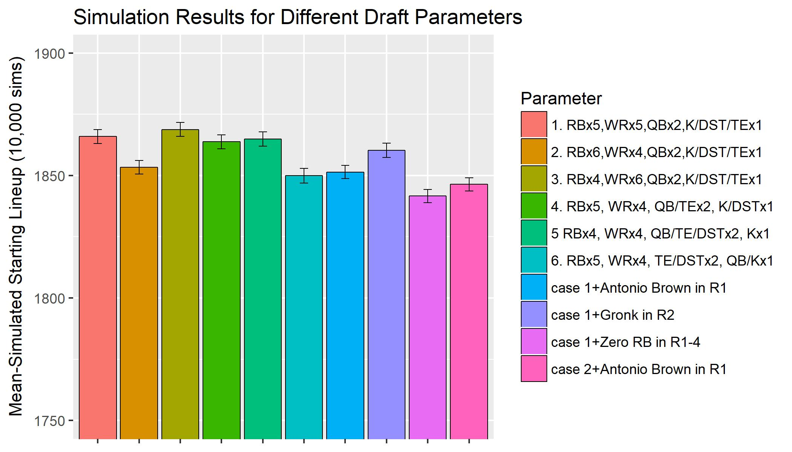
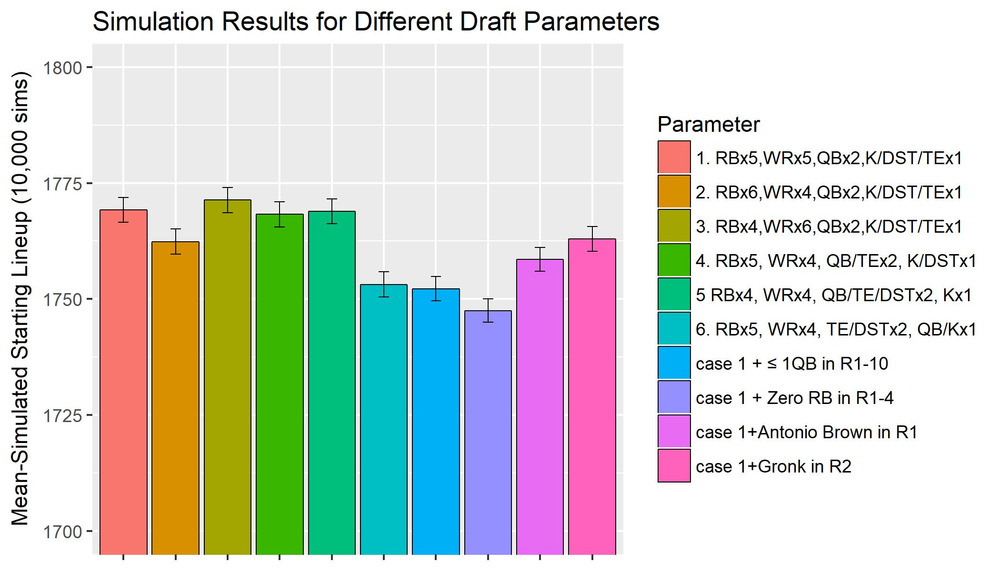

---

##Base Case

```{r set-options, echo=FALSE, cache=FALSE}
options(width = 10000)
```

Optimizing your strategy for a fantasy football draft is an interesting problem. Should you should go RB early? Wait on RB's? Should you do something productive with your free time instead of fantasy football? (probably). Optimizing your draft picks can be viewed as an optimization where you try to maximize the projected points of your selected players. In this post I will go through my optimization methodology. To start, I have a dataframe of players and their projected points and their ADPs (Average draft positions).

```{r include=F, eval=T , echo=F}
###load and prepare data
library(ggplot2)
library(plyr)
library(rvest)
library(dplyr)
library(XML)
library(lpSolve)
options(stringsAsFactors = F)

load("Draft Data.RData")
# adp$ADP_sim<-rnorm(nrow(adp), mean = adp$ADP_est, sd=adp$ADPSD_est)

adp<-adp[order(adp$ADP_est, decreasing = F),]

adp$ADP_Rank[!is.na(adp$ADP_est)]<-rank(adp$ADP_est[!is.na(adp$ADP_est)])
adp$ADP_Rank[is.na(adp$ADP_Rank)]<-500 #undrafted

adp[, c("HALF", "PPR","STD")][is.na(adp[, c("HALF", "PPR","STD")])]<-0 #no projection


customProj<-function(type="STD"){
  proj<-read.csv(paste(c("Projections_", type,".csv" ), collapse=""))
  proj<-proj[proj$Season==2018& proj$Player%in% adp$Player, c("Player","PosFFA", "Season", "Team", "fantPts_agg")]
  colnames(proj)[colnames(proj)=="fantPts_agg"]<-type
  colnames(proj)[colnames(proj)=="PosFFA"]<-"Pos"
  proj$Pos<-ifelse(grepl("LB", proj$Pos), "LB",
                   ifelse(grepl("DT|DL|DE|NT", proj$Pos)| proj$Pos%in% "T", "DL", 
                          ifelse(grepl("SS|FS|DB|CB", proj$Pos)| proj$Pos%in% "S", "DB", proj$Pos)))
  proj$Pos[grepl("FB", proj$Pos)]<-"RB"
  proj$Pos<-gsub("[/]", ";", proj$Pos)
  proj<-proj[, c("Player","Pos", "Team",type)]
  proj
}
projections<-Reduce(function(dtf1, dtf2)  merge(dtf1, dtf2, by =c("Player", "Team", "Pos"), all = TRUE), lapply(c("HALF", "STD", "PPR"), customProj))
projections<-projections[!projections$Pos%in% c("LB", "DL", "DB"),, ]
projections<-projections[order(projections$STD,decreasing = T), ]
projections<-projections[!duplicated(projections$Player), ]

adp<-merge(adp, projections[, c("Player", "HALF", "STD", "PPR")], by=c("Player"), all.x=T)
adp$HALF<-ifelse(is.na(adp$HALF.y), adp$HALF.x, adp$HALF.y)
adp$STD<-ifelse(is.na(adp$STD.y), adp$STD.x, adp$STD.y)
adp$PPR<-ifelse(is.na(adp$PPR.y), adp$PPR.x, adp$PPR.y)
adp<-adp[, !grepl("[.]", colnames(adp))]
adp<-adp[order(adp$ADP_est, decreasing = F),]

```

```{r include=T, eval=T , echo=T}
head(adp, 25)
```


<br />For league settings, I am using Yahoo's defaults^[12-team league with 15 picks per team. Positions=1 QB, 2 WR, 2 RB, 1 TE, 1 FLEX, 1 DST, 1 K. Scoring = .5 PPR ].  I can then easily set up an optimization where I say to maximize the sum of the projected points of the 15 players taken. Given the slot I am picking at, which for this example I will say is slot 4, I just constrain it to take 15 players with ADP>=4, 14 players with ADP>=21, etc. The end result is a function which takes different parameters for the optimization and returns the optimal draft picks.

```{r include=T, eval=T , echo=F}


getPicks<-function(slot,numTeams=12, numRB=2, numWR=2, numTE=1, numQB=1,numK=1, numFLEX=1, numDST=1, shift=0,
                   out=c(), fix=c(), scoring="HALF", strategy=c(),adpCol="ADP_Rank", outPos=c(),onePos=c()){
  # slot<-"Slot4";numRB<-5;numWR<-5;numTE<-1;numQB<-1;numK<-1;numFLEX<-1;numDST<-1;shift<-0;out<-c();fix<-c();scoring<-"HALF";numTeams<-12
  #1qb, 3wr, 2rb, 1te, 1def, 1k, 1flex, 7 bench
  #dataframe of snake draft
  
  numPicks<-numRB+numQB+numWR+numTE+numFLEX+numDST+numK
  
  pickDF<-data.frame(matrix(NA, ncol=numTeams, nrow=numPicks))
  colnames(pickDF)<-paste("Slot", 1:numTeams, sep="")
  last<-0
  for(i in 1:numPicks){
    if(i%%2==1){
      pickDF[i, ]<-(last+1):(last+numTeams)
    }else{
      pickDF[i, ]<-(last+numTeams):(last+1)
      
    }
    last<-last+numTeams
  }
  
  
  model <- list()
  optmode<-'lpsolve'
  A<-matrix(0, ncol=nrow(adp), nrow=1000) #cols=decision variables, rows=constraints on variables
  model$obj<-adp[, scoring]  #goal to maximize sum of FPTS for chosen variables
  model$modelsense <- "max"
  
  #position constraints
  q<-1
  A[q, grep("RB", adp$Pos)]<-1; model$sense[q]<-">="; model$rhs[q]<-numRB;q<-q+1 #>=2 RBs
  A[q, grep("WR", adp$Pos)]<-1; model$sense[q]<-">="; model$rhs[q]<-numWR;q<-q+1 #>=3 WRs
  A[q, grep("TE", adp$Pos)]<-1; model$sense[q]<-">="; model$rhs[q]<-numTE;q<-q+1 
  A[q, grep("QB", adp$Pos)]<-1; model$sense[q]<-">="; model$rhs[q]<-numQB;q<-q+1
  A[q, grep("K", adp$Pos)]<-1; model$sense[q]<-">="; model$rhs[q]<-numK;q<-q+1 
  A[q, grep("DST", adp$Pos)]<-1; model$sense[q]<-">="; model$rhs[q]<-numDST;q<-q+1
  A[q, grep("WR|RB|TE", adp$Pos)]<-1; model$sense[q]<-">="; model$rhs[q]<-numRB+numWR+numTE+numFLEX;q<-q+1
  
  A[q, 1:nrow(adp)]<-1; model$sense[q]<-"<="; model$rhs[q]<-numPicks;q<-q+1 #constrain total numPicks
  
  A[q, adp$Player%in% out]<-1; model$sense[q]<-"<="; model$rhs[q]<-0;q<-q+1 #constrain total numPicks
  A[q, adp$Player%in% fix]<-1; model$sense[q]<-">="; model$rhs[q]<-sum( adp$Player%in% fix);q<-q+1 #constrain total numPicks
  
  
  #1st pick needs 10 players with ADPs above its slot, 2nd pick needs 9 players, etc.
  tot<-numPicks
  for(i in 1:numPicks){
    storePick<-pickDF[i, slot]
    A[q, which(adp[,adpCol]*(1-shift)>=storePick)]<-1; model$sense[q]<-">="; model$rhs[q]<-tot;q<-q+1  #must include a player with adp greater than or equal to pick number
    tot<-tot-1 #first pick needs to have every pick be after it, each subsequent pick needs one less to be after it
  }
  
  if(length(onePos)>=1){
    storePick<-pickDF[length(onePos)+1, slot]
    # numPos<-get(paste0("num", onePos[1])) #need to take at least numPos-1 players at 
    A[q, which(adp[,adpCol]*(1-shift)<storePick& adp$Pos==onePos[1])]<-1; model$sense[q]<-"<="; model$rhs[q]<-1;q<-q+1  #must include a player with adp greater than or equal to pick number
  }
  
  if(length(outPos)>=1){
    storePick<-pickDF[length(outPos)+1, slot]
    # numPos<-get(paste0("num", outPos[1])) #need to take at least numPos-1 players at 
    A[q, which(adp[,adpCol]*(1-shift)<storePick& adp$Pos==outPos$Pos[1])]<-1; model$sense[q]<-"<="; model$rhs[q]<-0;q<-q+1  #must include a player with adp greater than or equal to pick number
  }
  
  
  
  model$vtype   <- 'B'
  params <- list(OutputFlag=0)
  model$A<-A[1:(q-1),]
  
  if(optmode=="lpsolve") {
    result<-lp ("max", objective.in=model$obj, const.mat=A[1:(q-1),],
                const.dir=model$sense, const.rhs=model$rhs, all.bin=TRUE )
    result$x<-result$solution
  }
  
  picks<-adp[as.logical(result$x),]
  picks$Slot<-pickDF[, slot]
  picks[,c("Player", "ADP_est", adpCol, "Pos",scoring, "Slot")]
}
```

```{r include=T, eval=T , echo=T}
getPicks(slot="Slot4", numRB=4, numWR = 6,numTE=1,numK=1,numQB=2, numDST=1,numFLEX = 0,shift=0,  out=c(), fix=c(), scoring='HALF')
```

<br />The parameters of getPicks() specify number of players at each position to take. I also added the shift parameter which can shift everyone's ADP by a given fraction i.e. shift=.1 would subtract 10% from everyone's ADP. I can also make adjustments like constraining to only select 1QB in the first 10 rounds.

```{r include=T, eval=T , echo=T}
getPicks(slot="Slot4", numRB=4, numWR = 6,numTE=1,numK=1,numQB=2, numDST=1,numFLEX = 0,shift=0,  out=c(), fix=c(), scoring='HALF', onePos=rep("QB", 10))
```


Rotoviz [already has an app](http://rotoviz.com/2017/08/using-the-rotoviz-draft-optimizer-to-dominate-your-ppr-draft/) which does a similar optimization. The results do seem to suggest certain things like how you should often take RB's early. Looking at the optimal first two picks for each draft slot, you can see how RB's are usually suggested for the early picks:

```{r include=T, eval=T , echo=T}
sapply(paste0("Slot", 1:12), function(x) getPicks(slot=x, numRB=4, numWR = 6,numTE=1,numK=1,numQB=2, numDST=1,numFLEX = 0,shift=0,  out=c(), fix=c(), scoring='HALF')[1:2,],simplify = FALSE,USE.NAMES = TRUE)
```

<br />There are some shortcomings with using this basic optimization to inform your strategy. First of all, the thing you want to optimize is not all of your picks' points--**a more appropriate objective would be to draft in a way that will give you the eventual best starting lineup**. This would ideally take into account the uncertainty of the projections, the fact that you can only start a limited number of each position, and the possibility of getting waiver wire adds. I'll show how I account for this below.


---

##More Complex Case
For the more complicated case, my methodology will be to get an optimal lineup, but I will evaluate its performance not by the sum of the projected points, but rather by how strong it's mean-simulated top starting lineup is. I will explain this in depth later. To do this method though, I will first need estimates of the errors of the projections. It is widely assumed that RBs have errors with high variance while something like a TE has low variance, and so this should be accounted for when simulating the actual values from the projections.

###Error Analysis

I summarize below the projection error (projected-actual) for 2012-2017, grouped by projection range and position.

```{r include=T, eval=T , echo=F}

projections<-read.csv(paste(c("Projections_HALF.csv" ), collapse=""))
colnames(projections)[colnames(projections)=="PosFFA"]<-"Pos"
projections$Pos<-ifelse(grepl("LB", projections$Pos), "LB",
                        ifelse(grepl("DT|DL|DE|NT", projections$Pos)| projections$Pos%in% "T", "DL", 
                               ifelse(grepl("SS|FS|DB|CB", projections$Pos)| projections$Pos%in% "S", "DB", projections$Pos)))
projections$Pos[grepl("FB", projections$Pos)]<-"RB"
projections$Pos<-gsub("[/]", ";", projections$Pos)
projections$fantPts_bin<-cut(projections$fantPts_agg, breaks=c(-50, 50, 100, 150, 200, 250, 400))
errors<-ddply(projections[which(projections$Season>=2012& projections$fantPts_agg>=50& !is.na(projections$fantPts_bin) & projections$Pos!=""),], .(fantPts_bin, Pos),summarize,  
              meanError=mean(fantPts_agg-fantPts, na.rm=T),
              medianError=median(fantPts_agg-fantPts, na.rm=T),
              meanRelativeError=mean((fantPts_agg-fantPts)/fantPts_agg, na.rm=T),
              sdError=sd(fantPts_agg-fantPts, na.rm=T), 
              n=sum(!is.na(fantPts_agg-fantPts)))
errors<-errors[errors$n>20,]
errors<-errors[order(errors$Pos, errors$fantPts_bin),]
errors<-errors[which(errors$Pos%in% c("K",  "DST", "QB", "RB", "WR", "TE")),]
errors
```

Plotting the above standard deviations of the errors by position:

```{r  fig1, include=T, eval=T , echo=F,  fig.height = 3, fig.width = 5, fig.align = "center"}

ggplot(errors, aes(fantPts_bin, sdError,colour=Pos)) + 
  geom_line(aes(group = Pos)) + geom_point()+
  xlab("Projection") +ylab("SD of Projection Error")

```

I can also look at an example plot of one of these subgroups ex: WRs with projections between 150-200:

```{r fig2, include=T, eval=T , echo=F, fig.height = 3, fig.width = 5, fig.align = "center"}
hist(projections$fantPts_agg[projections$Pos=="WR"& projections$Season%in% 2012:2017& as.character(projections$fantPts_bin)=="(150,200]"]-
       projections$fantPts[projections$Pos=="WR"& projections$Season%in% 2012:2017& as.character(projections$fantPts_bin)=="(150,200]"], 
     main="WR Projected-Actual, 150 to 200 FPTS projected", xlab="")
```


Looking at the above data and plots, I see how error variance is a function of position and projection. Looking at the example histogram above, the errors do appear pretty normally distributed. I should mention that in the table I do see that there appears to be bias in my projections for certain positions (positive mean/median value implies projections that are overprojecting), I will revisit this at another time and for now assume unbiased errors. Below is an overview of the assumptions I am making when I simulate the seasons.

**Assumption 1.** For simplicity I am assuming that errors are normally distributed with mean 0 and a standard deviation based on the SD for their position and projection.<br /> **Assumption 2.**  I also assume that you will be able to pick up undrafted players. I assume you will be able to get the third highest performing undrafted player at each position. This may be aggressive but it's likely that if you only need DST and TE mid-season, you will be able to get a strong one at both.

###Simulation
Finally, I am ready to simulate a season from my optimal lineup.

```{r  include=F, eval=T , echo=F}
source("simulate season.R")
```

First I get the optimal picks at Slot=4/12, same as in base case:

```{r  include=T, eval=T , echo=F}
picks<-getPicks(slot="Slot4", numRB=4, numWR = 6,numTE=1,numK=1,numQB=2, numDST=1,numFLEX = 0,shift=0,  out=c(), fix=c(), scoring='HALF')
picks
```

Then I can get the top starting lineup from 1 simulation, Projected Points=HALF. Simulated Points=Sim:

```{r  include=T, eval=T , echo=F}
topLineup<-simSeason(adp, scoring = "HALF") %>% getTopLineup(., picks, returnLineup = T  )
topLineup
```

Finally, I can repeat this a large number of times to get the mean-simulated optimal lineup from a set of picks. 


###Optimizing Parameters

The last step of the system is to test different parameters. I can specify things like number of players to take at each position or whether I should lock in a certain player. I repeat the above simulation many times and I want to find the parameters that result in the best mean-simulated optimal lineup. Below I plot the simulation results for different parameter combinations. <br /> <br /> 



<br /> In the plot you can see the effect of different actions. For example, it suggests you should definitely take 2 QBs, as the 1 QB test (case 6) performs very poorly. Taking Antonio Brown instead of Kamara in round 1 slightly decreases the median-simulated starting lineup, despite Antonio Brown's raw projection actually being higher than Kamara's. The planned draft from the optimal parameter combo (case 3) is shown below.

```{r  include=T, eval=T , echo=T}
getPicks(slot="Slot4", numRB=4, numWR = 6,numTE=1,numK=1,numQB=2, numDST=1,numFLEX = 0,shift=0,  out=c(), fix=c(), scoring='HALF')
```


###Analyzing Bias
Before I mentioned that the projections I am using have been biased for certain positions. For the last part of my analysis I'd like to see how the bias might affect my results. Looking at the errors, I'm going to create a shifted projection "HALF2" that accounts for bias and then I will repeat the previous analysis.

```{r  include=T, eval=T , echo=T}
#shift RB-20, TE-10, QB-10, WR-15, DST+10:
adp$HALF2<-ifelse(adp$Pos=="RB"& adp$HALF>=100, adp$HALF-20,
                  ifelse(adp$Pos%in% c("TE", "QB")& adp$HALF>100, adp$HALF-10, 
                         ifelse(grepl("WR", adp$Pos)& adp$HALF>100, adp$HALF-15, 
                                ifelse(adp$Pos%in% "DST", adp$HALF+10, adp$HALF   )))) 

#getPicks() with "HALF2" scoring
getPicks(slot="Slot4", numRB=4, numWR = 6,numTE=1,numK=1,numQB=2, numDST=1,numFLEX = 0,shift=0,  out=c(), fix=c(), scoring='HALF2')

```


The optimal solution for the base case does not change anything. Thinking about it, it makes sense. I need to take a fixed number at each position and so am basically judging each position independently and shifting it doesn't have an effect. Next I repeat the parameter optimization to see the effect of my projections' bias on that.





The results are similar and back up many of the initial findings.

---

##Conclusion

In conclusion, I created a system that optimizes to get the best eventual starting lineup for fantasy football. In testing different strategies, it seems you should definitely draft 2 QBs, you should probably draft RB first, and you should most likely not do zero-RB. I also looked at bias in my projections and found that having projections that are biased for a certain position does not have much effect on the results. The main flaw still remaining in all of this is the uncertainty in opponent picks. If an optimal strategy depends on getting a high value QB in round 10 for example, it should factor in what happens if someone else takes the QB. I will talk about that in a future post. <br /><br />


